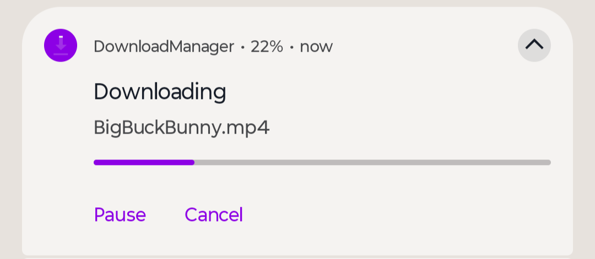
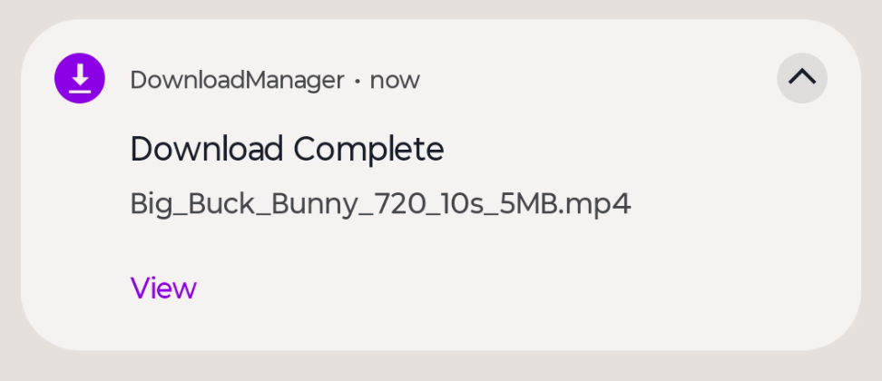
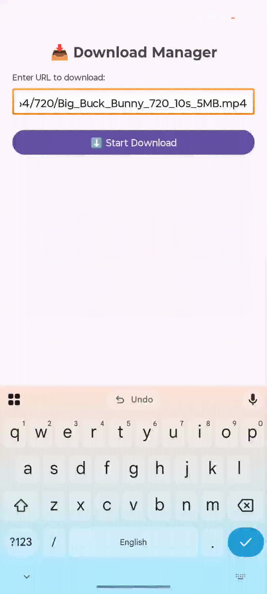

# Download Manager Library
[](https://kotlinlang.org/)
[](LICENSE)
[](#)
[](#)

**A powerful, resumable, foreground-service-based Download Manager for Android** with real-time progress updates, pause/resume/cancel support, notification controls, and automatic file handling.

Supports large files, resume after app restart/pause, works in background, and shows beautiful progress notifications with action buttons.

---
## Preview
| process State | Completed with View Button |
|--------------|-----------------------------|
|  |  |

### Demo Video


---
## Features
- **Resumable Downloads** – Survives app close, pause, or process death
- **Foreground Service** – Reliable background downloading with system priority
- **Real-time Progress** – Smooth notification updates every 500ms
- **Pause / Resume / Cancel** – Full control via notification actions
- **Automatic File Management** – Saves to `Android/data/your.package/files/downloads/`
- **Open File on Completion** – Tap "View" to open PDF, video, image, APK, etc.
- **Broadcast Updates – Receive progress, pause, complete events in your Activity
- **Clean & Lightweight** – No external dependencies, pure Kotlin + Coroutines
- **Android 13+ Ready** – Proper notification permission handling
- **FileProvider Support** – Safely share downloaded files with other apps

---
## Installation

**Step 1:** Add JitPack repository to your root `build.gradle` (or `settings.gradle`):

```gradle
// settings.gradle (newer projects)
dependencyResolutionManagement {
    repositories {
        maven { url 'https://jitpack.io' }
    }
}
```

or in older projects:

```gradle
allprojects {
    repositories {
        maven { url 'https://jitpack.io' }
    }
}
```

**Step 2:** Add the dependency

```gradle
dependencies {
    implementation 'com.github.YourUsername:DownloadManager:1.0.0'
}
```
---
## Permissions Required

Add to your `AndroidManifest.xml`:

```xml
<uses-permission android:name="android.permission.INTERNET" />
<uses-permission android:name="android.permission.FOREGROUND_SERVICE" />
<uses-permission android:name="android.permission.FOREGROUND_SERVICE_DATA_SYNC" />
<uses-permission android:name="android.permission.POST_NOTIFICATIONS" /> <!-- Android 13+ -->
```

Also add FileProvider:

```xml
<provider
    android:name="androidx.core.content.FileProvider"
    android:authorities="${applicationId}.fileprovider"
    android:exported="false"
    android:grantUriPermissions="true">
    <meta-data
        android:name="android.support.FILE_PROVIDER_PATHS"
        android:resource="@xml/file_paths" />
</provider>
```

Create `res/xml/file_paths.xml`:

```xml
<?xml version="1.0" encoding="utf-8"?>
<paths>
    <external-files-path name="downloads" path="downloads/" />
</paths>
```

---
## Usage

### 1. Start a Download

```kotlin
val intent = Intent(this, DownloadForegroundService::class.java).apply {
    action = DownloadForegroundService.ACTION_START
    putExtra(DownloadForegroundService.EXTRA_URL, "https://example.com/large-file.zip")
    putExtra(DownloadForegroundService.EXTRA_FILENAME, "MyVideo.mp4") // optional
}
if (Build.VERSION.SDK_INT >= Build.VERSION_CODES.O) {
    startForegroundService(intent)
} else {
    startService(intent)
}
```

### 2. Pause / Resume / Cancel

```kotlin
// Pause
startService(Intent(this, DownloadForegroundService::class.java).apply {
    action = DownloadForegroundService.ACTION_PAUSE
})

// Resume (automatically resumes last download)
startService(Intent(this, DownloadForegroundService::class.java).apply {
    action = DownloadForegroundService.ACTION_RESUME
})

// Cancel (deletes file)
startService(Intent(this, DownloadForegroundService::class.java).apply {
    action = DownloadForegroundService.ACTION_CANCEL
})
```

### 3. Listen to Progress (in Activity/Fragment)

```kotlin
private val downloadReceiver = object : BroadcastReceiver() {
    override fun onReceive(context: Context?, intent: Intent?) {
        when (intent?.getStringExtra(DownloadForegroundService.EXTRA_STATUS)) {
            "progress" -> {
                val downloaded = intent.getLongExtra(DownloadForegroundService.EXTRA_DOWNLOADED, 0L)
                val total = intent.getLongExtra(DownloadForegroundService.EXTRA_TOTAL, -1L)
                val percent = if (total > 0) (downloaded * 100 / total) else 0
                tvProgress.text = "Downloading: $percent% (${formatBytes(downloaded)} / ${formatBytes(total)})"
            }
            "completed" -> {
                Toast.makeText(this@MainActivity, "Download Completed!", Toast.LENGTH_LONG).show()
            }
            "paused" -> tvProgress.text = "Paused"
            "canceled" -> tvProgress.text = "Canceled"
        }
    }
}

override fun onStart() {
    super.onStart()
    registerReceiver(downloadReceiver, IntentFilter(DownloadForegroundService.BROADCAST_PROGRESS))
}

override fun onStop() {
    super.onStop()
    unregisterReceiver(downloadReceiver)
}
```

---
## Actions & Extras

| Constant | Value | Description |
|--------|------|------------|
| `ACTION_START` | `"download_manager.action.START"` | Start new download |
| `ACTION_PAUSE` | `"download_manager.action.PAUSE"` | Pause current download |
| `ACTION_RESUME` | `"download_manager.action.RESUME"` | Resume paused download |
| `ACTION_CANCEL` | `"download_manager.action.CANCEL"` | Cancel & delete file |
| `EXTRA_URL` | `"extra_url"` | Download URL (required for START) |
| `EXTRA_FILENAME` | `"extra_filename"` | Custom filename (optional) |
| `BROADCAST_PROGRESS` | `"download_manager.broadcast.PROGRESS"` | Listen for updates |
| `EXTRA_STATUS` | `"extra_status"` | `"progress"`, `"completed"`, `"paused"`, `"canceled"` |
| `EXTRA_DOWNLOADED` | Long | Bytes downloaded so far |
| `EXTRA_TOTAL` | Long | Total bytes (-1 if unknown) |

---
## Downloaded Files Location

Files are saved to:

```
Android/data/your.package.name/files/downloads/
```

Accessible via:
```kotlin
File(getExternalFilesDir(null), "downloads")
```

---
## Notification Features

- Progress bar with percentage
- Pause/Resume button (toggles dynamically)
- Cancel button
- On completion: "View" button to open file instantly
- Works even when app is closed

---
## Dependencies

- None! Pure AndroidX + Kotlin Coroutines (built-in)

---
## Example App Included

The library comes with a fully working demo app showing:
- URL input field
- Start/Pause/Cancel buttons
- Real-time progress display
- File list dialog
- Auto-open on completion

---
## License

```
MIT License

Copyright (c) 2025 Excelsior Technologies 

Permission is hereby granted, free of charge, to any person obtaining a copy
of this software and associated documentation files (the "Software"), to deal
in the Software without restriction, including without limitation the rights
to use, copy, modify, merge, publish, distribute, sublicense, and/or sell
copies of the Software, and to permit persons to whom the Software is
furnished to do so, subject to the following conditions:

The above copyright notice and this permission notice shall be included in all
copies or substantial portions of the Software.

THE SOFTWARE IS PROVIDED "AS IS", WITHOUT WARRANTY OF ANY KIND, EXPRESS OR
IMPLIED, INCLUDING BUT NOT LIMITED TO THE WARRANTIES OF MERCHANTABILITY,
FITNESS FOR A PARTICULAR PURPOSE AND NONINFRINGEMENT. IN NO EVENT SHALL THE
AUTHORS OR COPYRIGHT HOLDERS BE LIABLE FOR ANY CLAIM, DAMAGES OR OTHER
LIABILITY, WHETHER IN AN ACTION OF CONTRACT, TORT OR OTHERWISE, ARISING FROM,
OUT OF OR IN CONNECTION WITH THE SOFTWARE OR THE USE OR OTHER DEALINGS IN THE
SOFTWARE.
```


---
